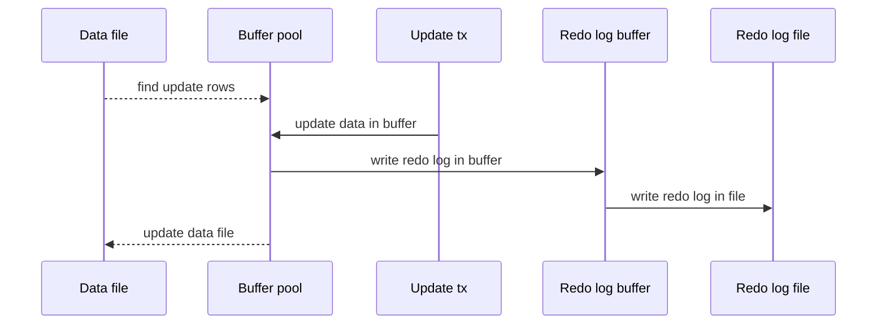
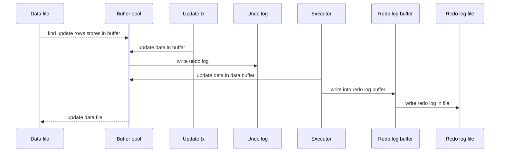

## 概述

MySQL中仅`innoDB`支持事务

<!-- more -->

## 事务特性

* 原子性：事务是不可分割的工作单位，全部提交/失败回滚，不存在中间状态

  undo log保证

* 一致性：事务执行前后数据从一个合法状态变换到另一个合法状态

  undo log保证

* 隔离性：事物的执行不能被其它事务干扰

  锁机制实现

* 持久性：事务被提交后对数据改变是永久的

  redo log保证

## 隔离级别

### 并发问题

* 脏写：事务A修改了未提交的事务B修改过的数据，所有隔离级别都不允许出现

* 脏读：事务A读到事务B未提交的数据

* 不可重复读：事务A每次都读到事务B已经提交的最新数据

* 幻读：事务A在进行范围读取的时候能读到事务B已经提交的新插入的符合该范围的数据

  （注意：先前读到后面读不到的情况属于不可重复读）

### 级别

> 并发能力从高到低，解决的并发问题从少到多

* 读未提交

  不加读锁，解决脏写

* 读已提交

  不加读锁，解决脏写，脏读

* 可重复读

  不加读锁，解决脏写，脏读，不可重复读

  （在`innoDB`的可重复读级别解决了幻读）

* 可串行化

  加读锁，并发问题全部解决

  

## 事务日志

### redo log

* 记录物理级别的页修改，由存储引擎层产生

* 内存中的数据在写入磁盘之前先写redo log(WAL, write ahead logging，日志写入成功事务才算提交成功)，意味着事务一旦提交成功就保证它存在于redo log

特点：

1. 顺序IO，相比数据页的写入的随机IO，性能大幅提高

组成：

1. redo log buffer -- default：16mb
2. redo file

运转流程：




redo log刷盘策略

1. 每次事务提交不做任何动作，交给后台master thread每隔1s进行一次redo log同步
2. 每次事务提交都buffer内容写入page cache并同步刷盘（default）
3. 每次事务提交只把buffer内容写入page cache，不同步，让OS决定同步刷盘时间

用途

1. 数据库恢复的时候使用，保证持久性


### undo log

* 记录的是逻辑操作的日志（记录SQL语句）

* 事务更新操作的之前会预先写入一个undo log

* undo log会产生redo log

生命周期：




生成过程：

* 行记录隐藏列

  1. DB_ROW_ID：行id
  2. DB_TRX_ID：事务id
  3. DB_ROLL_PTR：回滚指针，指向上一个undo log

* insert时

  生成一条insert undo log，记录undo log序号，主键和列值。

  进行回滚值需把逐渐对应数据删除即可

* update时

  不更新主键：

  1. 生成一个新的undo log（log A），记录列信息

  2. log A指向记录的回滚指针指向的undo log（log B）
  3. 记录的回滚指针指向log A

  更新主键：

  1. 将原纪录（record A）`deletemark` = 1
  2. record A的回滚指针指向记录`deletemark` = 1的过程的undo log
  3. 生成一条新纪录（record B）
  4. record B的回滚指针指向记录更改主键的过程的undo log

undo log删除

* insert undo log

  事务提交后可以直接删除

* update undo log

  需要提供MVCC机制的支持，事务提交时需要放入undo log链表等待purse线程去删除

用途：

1. 事务回滚
2. MVCC


## 锁

### 内存结构

* 锁所在事务信息
* 索引信息
* 表锁/行锁信息
* type_mode
* 其它信息
* 比特位


### 共享锁

S锁

```mysql
SELECT * FROM your_table LOCK IN SHARE MODE;
# >= 8.0
SELECT * FROM your_table FOR SHARE;
```


### 排他锁

X锁

```mysql
SELECT * FROM your_table FOR UPDATE;
```


### 表锁

```mysql
# S LOCK
LOCK TABLES your_table READ;
# X LOCK
LOCK TABLES your_table WRITE
```

| 类型 | 自己可读 | 自己可写 | 自己可操作其他表 | 他人可读     | 他人可写     |
| ---- | -------- | -------- | ---------------- | ------------ | ------------ |
| S    | True     | False    | False            | True         | False, Block |
| X    | True     | True     | False            | False, Block | False, Block |

意向锁

* 事务获取某些记录的共享锁时需要给当前表添加意向共享锁(IS)
* 事务获取某些记录的排他锁时需要给当前表添加意向排他锁(IX)
* IS和IX均互相兼容，IS和S兼容，其余情况均互斥

自增锁 - AUTO-INC


### 行锁

存储引擎层实现

1. 记录锁

2. 间隙锁

   * 对某行记录加上间隙锁，表示不允许对该记录前面的间隙（开区间）插入新的记录

   * 在为了防止插入幻影记录提出

   * 可重入

   * 间隙锁会导致死锁

     比如两个事务先分别锁了同一个范围，两边都成功上间隙锁后，再尝试向该范围插入记录，此时就会导致死锁

     

3. 临键锁

   下边界闭区间间隙锁

4. 插入意向锁

   插入位置被其它事务加入了间隙锁或者临键锁，此时本事务等待的时候生成一个插入意向锁

### 页锁

锁升级：行锁到一定空间会升级为页锁，页锁到一定空间升级为表锁


### 悲观锁

基于数据库的锁机制来实现，适合写多读少的较短的事务场景

注意，使用悲观锁的时候一定要确保使用了索引而不是全表扫描。否在会把扫描过的记录全部锁住


### 乐观锁

基于程序设计实现，适用于多读的应用场景，提高吞吐

* 基于版本号机制，CAS机制

  设计一个版本字段version，修改的时候执行

  ```mysql
  UPDATE ... SET version=version+1 WHERE version=`current_version`
  ```

  1. 每次修改数据的时候version都会加1
  2. 当进行修改的时候发现version被更新了，修改会因为定位失败而不成功

* 基于时间戳机制

  将版本号换成时间戳进行比较

> 注意，在独写分离的场景下要强制读取master表中的数据，防止主从由于同步时间造成的不一致


### 显式锁

显式声明的锁


### 隐式锁

insert事务在执行前`innoDB`会为准备插入的新纪录隐式添加一个X锁


### 全局锁

锁住整个库


### 死锁

两个事务都在等待对方释放锁才可以继续执行，并且双方都不会释放自己的锁

死锁处理：

1. 超时：default 50s

2. 死锁检测

   主动回滚undo log数量最小的事务

   wait-for graph算法主动检测死锁

解决死锁：

造成死锁的原因是两个以上的事务加锁的记录的顺序不一致，因此解决关键是调整语句让加锁的记录的顺序一致即可
