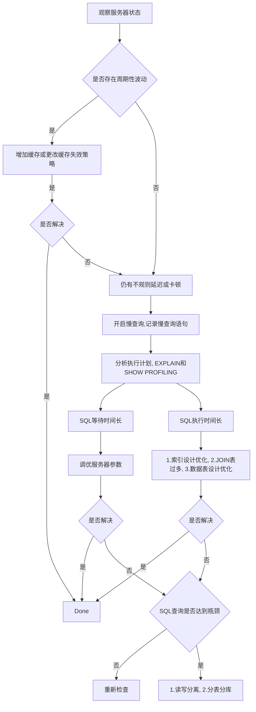

# 数据库优化流程

从四个角度去优化：1. 硬件，2. 系统配置，3. 数据库表结构，4. SQL与索引

优化流程：




# 慢查询日志

> 默认关闭，需要调优的时候打开
>
> 打开后将执行时间大于long_query_time的语句写入文件

分析慢查询日志工具: `mysqldumpslow`，获取到具体的查询语句与耗费时间

# 查看执行成本

SHOW PROFILE，查看具体的每个步骤的开销


# 分析查询语句

>  EXPLAIN 或 DESCRIBE
>
>  可以使用FORMAT=\<format\>语句来指定分析语句的展示格式，不指定则是默认的格式
>
>  * `EXPLAIN FORMAT=JSON SELECT * FROM user;`
>  * `EXPLAIN FORMAT=TREE SELECT * FROM user;`

## id

一个select对应一个id

> 注意，不一定是输入的查询命令中的select个数，而是实际执行的select个数，输入的命令可能会被查询优化器重写
>
> 临时表的id为NULL

## select_type

1. SIMPLE

   不包含UNION和子查询都是SIMPLE类型

2. UNION RESULT

   使用UNION的时候，由于需要去重，因此会生成一个临时表（id为NULL），该查询的类型为UNION RESULT

   但如果是UNION ALL的是时候由于无需去重，就可以不用生成该临时表了

3. SUBQUERY

   子查询无法转成多表连接时，如果不是相关子查询，子查询类型是SUBQUERY

4. DEPENDENT SUBQUERY

   子查询无法转成多表连接时，如果是相关子查询，子查询类型是DEPENDENT  SUBQUERY

5. DEPENDENT UNION

   子查询是UNION的时候，如果都依赖外侧查询，那么除了最左侧的查询以外的子查询类型都是DEPENDENT UNION

6. DERIVED

   派生的表，通常是进行了聚合过后的结果

7. MATERIALIZED

   优化器执行包含子查询的时候选择将子查询物化之后与外侧查询进行连接查询

## type（重点）

访问类型，下面的对访问类型的解析从最优到最劣

>system > const > eq_ref > ref > fulltext > ref_or_null > index_merge > unique_subquery > index_subquery > range > index > all
>
>
>
>日常至少要达到range级别，最好是ref以上


1. system

   没有进行数据遍历，而是直接在系统内部直接记录了某个结果（比如MyISAM中的统计数据），最快

2. const

   根据主键或者唯一的二级索引与常数进行等值匹配

   ```mysql
   EXPLAIN SELECT * FROM s1 WHERE id = 1;
   ```

   

3. eq_ref

   连接查询时，被驱动表是通过主键或者唯一的二级索引字段等值匹配的方式进行访问

   ```mysql
   EXPLAIN SELECT * FROM s1 INNER JOIN s2 ON s1.id = s2.id;
   ```

   

4. ref

   普通二级索引与常量等值匹配来查询时

   ```mysql
   EXPLAIN SELECT * FROM s1 WHERE name = "test";
   ```

   

5. ref_or_null

   普通二级索引与常量等值匹配，且索引字段可以为NULL时来查询时

   ```mysql
   EXPLAIN SELECT * FROM s1 WHERE name = "test" OR name IS NULL;
   ```

6. index_merge

   使用多个索引字段进行OR匹配的时候，优化器会将其转为多个UNION的查询，然后再去重

   ```mysql
   EXPLAIN SELECT * FROM s1 WHERE key1 = 1 OR key2 = 1;
   ```

   

7. unique_subquery

   针对包含IN子查询的查询语句中，优化器决定将IN子查询转换为EXISTS子查询，且子查询可以使用主键进行等值匹配

   ```mysql
   EXPLAIN SELECT * FROM s1 WHERE key2 IN (SELECT id FROM s2 WHERE s1.key1 = s2.key1) OR key3 = 'a';
   ```

   

8. range

   索引字段进行范围区间的查询

   ```mysql
   EXPLAIN SELECT * FROM s1 WHERE key1 > 0 AND key1 < 100;
   EXPLAIN SELECT * FROM s1 WHERE key1 IN (1, 2, 3);
   ```

   

9. index

   当查询可以使用索引覆盖（查找和过滤的字段刚好都在索引内），但是需要扫描全部的索引记录时

   ```mysql
   # 联合索引字段为key1, key2, key3
   EXPLAIN SELECT key2 FROM s1 WHERE key3 = 'a';
   ```

   

10. all

    全表扫描，最差


## possible_keys

可能是用到的索引，并不是越多越好，越多可选的索引，挑选索引话的时间越多


## key

优化器真正使用到的索引


## key_len（重点）

实际使用到的索引长度（字节数），检查是否充分利用上了索引，该值越大越好，在联合索引中参考意义较大


## ref

使用索引字段等值查询时，与索引字段等值匹配的对象信息


## rows（重点）

预估该SELECT查询到的记录数目，该数值越小，说明数据越有可能在同一个数据页中，IO次数越少，效率越高


## filtered（重点）

满足需求的记录的百分比，越高越好

对于单表查询其实该值意义不大，在连接查询的时候，驱动表对应的执行计划记录的filter值，决定了被驱动表要执行的次数（rows * filtered）


## extra（重点）

一些额外的信息，重点关注以下内容

* Using where

  1. 全表扫描，且语句中的WHERE有针对该表的搜索条件时
  2. 使用索引，且语句中的WHERE包含除了索引以外的该表的非索引字段

* Using index

  查询的列和搜索条件中只包含属于某个索引的列，也就是可以使用覆盖索引的情况下会出现该信息，说明不用回表

* Using index condition pushdown

  索引条件下推：
  WHERE条件是需要使用索引字段，但是索引字段无法被使用的时候，如`WHERE key > 'a' AND key LIKE "%s"`，此时优化器会先去索引字段在二级索引中找到对应的记录的索引的值的列表，根据过滤过滤条件去过滤该列表后，根据列表中剩下的主键去进行回表查询。

  此举是为了减少回表的次数，由于回表行为本身是和随机IO行为，因此可以提高查询性能

* Using join buffer

  连接查询时驱动表没有索引，innoDB为其创建一块内存来加快查询速度

* Using filesort

  说明使用了非索引字段进行了排序，效率较差

* Using temporary

  使用临时表，体现在DISTINCT和UNION查询的时候，做去重用。建立和维护临时表的成别较高，最好能使用索引替代临时表

## SHOW WARNINGS

使用EXPLAIN语句查看某个查询的执行计划后，紧接着使用SHOW WARNINGS语句可以查询到这个执行计划的一些扩展信息，如优化器优化后大致的查询语句（不一定可以运行....）


# 索引优化与查询优化


## 索引失效

> 使用索引与否，都是优化器说了算
>
> 优化器基于cost开销来决定是否使用索引
>
> SQL语句是否使用索引跟数据库版本，数据量和数据选择度有关系


* 全值匹配

  使用WHERE语句进行全值匹配的场景应当给所涉及的列添加一个联合索引

* 最佳左前缀

  联合索引中的定义的字段，如果靠近左侧的字段都出现在WHERE条件中，则可以选用该索引

* 主键插入顺序

  最好不要用无序主键，如uuid

* 计算，函数与类型转换导致索引失效

  假设name是索引

  ```mysql
  EXPLAIN SELECT * FROM student WHERE name LIKE 'abc%'; # 用到索引
  EXPLAIN SELECT * FROM student WHERE LEFT(name) = 'abc'; # 用不到索引
  ```

  LEFT函数导致了索引失效

  ```mysql
  EXPLAIN SELECT * FROM student WHERE id + 1 = 10; # 用不到索引
  ```

  计算导致索引失效

* 范围条件右侧的列索引失效

  假设age, classId和name组成联合索引

  ```mysql
  EXPLAIN SELECT * FROM student WHERE age = 10 AND classId > 20 AND name = "test";
  ```

  上述查询只能用上age和classId两个字段作为索引，因为classId使用了范围索引，因此导致后面的索引失效了

  实际开发中在建立联合索引的时候应注意将范围查询的字段尽可能放到右侧

* 不等于索引失效

  不等于 != 或者 <> 会导致索引失效，但是注意，在满足覆盖索引的场合不等于也可能会使用上索引

* NULL

  IS NULL可以使用索引，IS NOT NULL不可以使用索引

  实际开发中尽可能为每个字段加上NOT NULL约束

* LIKE

  LIKE可以所用索引，NOT LIKE则不可以

  通配符开头的LIKE查询也会导致索引失效，如LIKE '%abc'

* OR

  前后存在非索引的列，索引失效

* 数据库的表和字符集同意使用utf8mb4

  统一字符集可以避免字符集转换产生的乱码，不同字符集比较浅需要进行转换，此时会导致索引失效

一般性建议：

* 单列索引，选过滤性更好的列
* 选择联合索引时，
  1. 过滤性最好的列越在左侧越好
  2. 范围查询的列在越右侧越好
  3. 当前查询的列最好能全部包含在索引中，避免回表


## 关联查询

驱动表：主表

非驱动表：从表


### JOIN原理

> 效率上看：
>
> index nested loop join > block nested loop join > simple nested loop join

* simple nested loop join - 简单嵌套循环连接

  > 驱动表和非驱动表在连接条件上都没有索引

  1. 驱动表获取一条数据
  2. 从非驱动表里面全表扫描，有符合连接条件的记录则输出到结果
  3. 重复步骤1，直到驱动表中的数据被扫描完

  开销统计：

  假设有A, B两个表

  | 开销统计           | simple nested loop join  |
  | ------------------ | ------------------------ |
  | 驱动表扫描次数     | 1                        |
  | 被驱动表表扫描次数 | Row(A)                   |
  | 读取记录数         | Row(A) + Row(B) * Row(A) |
  | JOIN比较次数       | Row(B) * Row(A)          |
  | 回表               | 0                        |

  

* index nested loop join - 索引嵌套循环连接

  > 要求被驱动表上必须有索引
  >
  > 将被驱动表的全表扫描过程替换为从索引中去查找

  | 开销统计            | index nested loop join          |
  | ------------------- | ------------------------------- |
  | 驱动表扫描次数      | 1                               |
  | 被驱动表表扫描次数0 | 0                               |
  | 读取记录数          | Row(A) + Match(Row(B))          |
  | JOIN比较次数        | Row(A) * Height(Index_B)        |
  | 回表                | Match(Row(B)) (or 0, if use pk) |

* block nested loop join - 块嵌套循环连接

  不是逐条获取驱动表的数据，而是一块一块地获取，引入join buffer缓冲区，减少IO次数

  n个表连接会有n-1个buffer

  | 开销统计           | block nested loop join                      |
  | ------------------ | ------------------------------------------- |
  | 驱动表扫描次数     | 1                                           |
  | 被驱动表表扫描次数 | Row(A) * column_size / join_buffer_size + 1 |
  | 读取记录数         | Row(A) + Row(B) * 被驱动表表扫描次数        |
  | JOIN比较次数       | Row(B) * Row(A)                             |
  | 回表               | 0                                           |

* hash join

  MySQL 8.0以上 nested loop join会默认替换为hash join

  优化器使用小表，利用join key在内存中建立hash表，然后扫描较大的表并探测散列表，找出与hash表匹配的行

  只能用于等值连接

### 外连接

人为指定驱动表，如LEFT JOIN的左侧是驱动表，右侧是被驱动表，但是也有可能被优化器进行修改成内连接，从而改变驱动表和被驱动表的位置

### 内连接

查询优化器可以决定谁作为驱动表，谁作为被驱动表

1. 表的连接条件中，如果只有一个字段有索引，那么优化器会选择该字段对应的表作为被驱动表

2. 两个表的连接条件都存在索引的前提下，小表作为驱动表

   > 什么是小表？
   >
   > 在经过过滤后剩下了的记录，乘以每行的大小，结果较小的一方称之为小表

   > 为什么是小表驱动大表？
   >
   > 相同的join_buffer大小，能容纳更多的小表的记录，减少外层循环的数据数量


## 子查询

子查询一般效率不高的原因:

> 1. 内层查询会建立临时表，查询完毕后再撤销临时表，会消耗较多CPU和IO资源，产生较多慢查询
> 2. 内存临时表和磁盘临时表都没有索引
> 3. 对于子查询结果集越大的情形，对查询性能影响越大

优化策略：

* 子查询优化为多表查询

  原SQL

  ```mysql
  SELECT * FROM student
  WHERE no IN (
  	SELECT monitor FROM class
      WHERE monitor IS NOT NULL
  );
  ```

  优化为：

  ```mysql
  SELECT s.* FROM student s JOIN class c
  ON s.no = c.monitor
  WHERE c.monitor IS NOT NULL;
  ```


## 排序优化

### Order By

两种排序

* FileSort

  内存中排序，CPU占用较高

* index

  无需再次进行排序

索引失效的场景：

* 当查询的字段较多，需要在二级索引中找到之后再进行回表的时候，优化器可能会判断直接全表取出到内存后直接filesort的开销较低，导致查询不使用已有的索引

  假设有student表中有联合索引，关联的字段是age，classid，no

  ```mysql
  EXPLAIN SELECT * FROM student ORDER BY age,classid,no; # 使用FILESORT
  ```

  由于字段权限，优化器可能判定造成大量回表，因此选择了filesort

  ```mysql
  EXPLAIN SELECT * FROM student ORDER BY age,classid,no LIMIT 10; # 使用index
  ```

  由于限制了返回的记录条数，优化器认为造成的回表的次数有限，因此使用了index

  ```mysql
  EXPLAIN SELECT age,classid FROM student ORDER BY age,classid,no; # 使用index
  ```

  由于查询的字段都被联合索引所覆盖，因此不用回表，优化器选择index

  上述的例子使用LIMIT来体现过滤数据，也可以使用WHERE来达到相同的效果，总而言之就是优化器认为回表的次数是否过多，若过多则会放弃使用索引从而直接所用filesort。核心还是分析经过过滤后剩下的记录是否较多，从而导致的回表次数较多来觉得是否使用索引进行排序

  

* ORDER BY和索引规则不一致时，索引失效

  

优化策略：

* 在ORDER BY子句中的字段添加索引

* ORDER BY最好不要SELECT *

* 尽量用index完成ORDER BY排序

* 当范围条件和排序字段出现二选一的时候，优先观察条件字段的过滤数量。如果过滤的数量足够多，而且排序的数据并不多的时候（记录数量不多filesort消耗的cpu也比较有限），优先把索引放在范围字段上

* 无法使用INDEX的时候要对FileSort进行调优：

  1. 尝试提高sort_buffer_size

  2. 尝试提高max_length_for_sort_data，增加使用单路排序算法的概率

     filesort算法

     * 双路排序（较慢）
     * 单路排序


### Group By

* 使用索引的原则几乎与order by保持一致
* group by是先排序，再分组
* where效率高于having
* 包含过滤排序的语句，实际开发中最好能保证where过滤出来的结果集合在1000行内


## 分页查询

> 总而言之，查询优化的重点就在于如何能扫描最少的记录，返回查询的结果


像`LIMIT 2000000, 10`这种语句，MySQL要排序前2000010条记录(也就是说要将前2000010先扫描加载到内存中)，但仅仅返回2000000 - 2000010条记录，其他记录丢弃，查询排序的代价非常高

```mysql
EXPLAIN SELECT * FROM student LIMIT 2000000, 10; # type是ALL，意味着不会用上主键索引
```


* 优化思路1

  使用自增的主键的表时，可以将limit查询转换为某个位置的查询，先使用索引定位与过滤，在分页

  ```mysql
  EXPLAIN SELECT * FROM student WHERE id > 2000000 LIMIT 10;
  ```

  

* 优化思路2

  现在索引上完成排序分页的操作，最后根据主键关联回表查询所需的内容。虽然也是加载了前2000010条记录排序了，但是因为仅是对索引的列进行排序，加载到内存中的数据还是比全量加载要好

  ```mysql
  EXPLAIN SELECT * FROM student t, (SELECT id FROM student ORDER BY id LIMIT 2000000, 10) a WHERE t.id = a.id
  ```

  

## 覆盖索引

当查询的字段刚好被联合索引的字段所覆盖的时候，就无需再进行回表操作即可获得结果

利：

* 避免回表

  回表行为是基于二级索引所找到的具体的主键回到聚簇索引找数据的行为，本身是一个随机IO的行为，

  在覆盖索引的场合避免该行为，在范围查询的场景就可以将随机IO转变成顺序IO，提高性能

弊：

* 额外的索引维护，额外的磁盘空间与数据增删改的时间开销


## 索引条件下推(ICP)

### 概念

优化器的行为，可以通过optimizer_switch参数打开或关闭

EXPLAIN命令中提示索引下推：extra字段中出现Using index condition

先过滤索引的检索结果，再根据过滤后的结果去回表查询具体数据

假设表people有联合索引，字段由zipcode，lastname和firstname组成，查询：

```mysql
EXPLAIN SELECT * FROM people
WHERE zipcode = '00001'
	AND lastname LIKE '%Test%'
	AND address LIKE '%NewYork%';
```

该查询中，zipcode属于联合索引，lastname也属于联合索引，但因为范围条件右侧的列索引的缘故导致索引失效，因此会索引仅根据zipcode来进行定位，获取id后再回表去查询记录，最后过滤符合lastname和address条件的记录。

但是这里因为lastname存在于二级索引之中，为了减少回表次数，优化器会在二级索引中对根据zipcode得到的记录先进行一次过滤，得到记录id后，再回表去取到对应记录，最后仅需根据address条件过滤结果。

由于再回表前过滤了数据，因此可以减少回表次数，减少随机IO，提高性能


### ICP的使用条件

1. 表访问类型是range，ref，eq_ref，ref_or_null时
2. 可用于InnoDB(仅用于二级索引，因为聚簇索引不需要回表)和MyISAM
3. 使用索引覆盖是不支持ICP，因为没有回表了
4. 相关子查询条件不能使用ICP


## 其他策略

### IN与EXISTS

核心还是小表驱动大表，假设有A，B两个表

* IN

  > 当B表较小时，选用IN

  ```mysql
  SELECT * FROM A WHERE id IN (SELECT id FROM B);
  ```

  IN实现相当于内表循环

  ```bash
  for j in B
  	for i in A
  		if i.id = j.id
  ```

  

* EXISTS

  > 当A表较小时，选用EXISTS

  ```mysql
  SELECT * FROM A WHERE EXISTS (SELECT id FROM B WHERE id=A.id)
  ```

  EXISTS实现相当于外表循环

  ```bash
  for i in A
  	for j in B
  		if i.id = j.id
  ```

  

### COUNT

在MyISAM中，统计表行数是O(1)

对于InnoDB

* COUNT(*)和COUNT(1)
  * 会挑选一个较小的二级索引，如果没有二级索引，就会使用主键

* count(具体field)

  尽量挑选二级索引去count，避免直接使用主键


### SELECT(*)

先去元数据查找具体字段，然后再替换到*中，整个过程相对耗时，因此建议查询的时候使用具体字段


### LIMIT 1

全表扫描找一条数据的时候可以加快速度，因为找到之后便不会继续扫描了

如果已经建立了唯一索引，那也就没有必要使用了


# 主键设计


* 自增id的问题

  1. 可靠性不高

     自增ID回溯问题

  1. 安全性不高

     对外暴露接口容易猜到对应信息

  1. 性能差

     需要服务器端生成

  1. 交互多

     业务方需要额外执行一条类型last_insert_id()的函数才知道刚刚插入的自增的id的值

  1. 局部唯一性

     只在当前数据库唯一，对于分布式来说不保证唯一


* 不推荐业务字段作为主键

  当遇到业务字段的某个值需要重用的时候会带来一连串的错误，非常不推荐。并且更改主键的成本往往是非常的高的


## 推荐的设计策略

* 非核心业务：使用自增id即可
* 核心业务：
  * 全局唯一
  * 单调递增
  * 推荐在业务端生成，如snowflake
  * 使用二进制存储，而不是字符串存储

对于UUID，5.7之前生成的UUID是无序的，因为时间位上的是从小到大，但是8.0之后时间位是可以使用从大到小，可以生成有序的UUID。


# 其他优化策略


## 优化数据库结构

* 表拆分

  冷热数据分离

  当一个表的字段很多的时候，把它拆成2个或者多个较小的表

  * 把查询频率和更新很高的表（热数据）放到一个表中
  * 把查询频率和更新较低的表（冷数据）放到一个表中

  原因是如果列很多的时候，把表加载到缓冲池中的时候会导致

  1. 占用的内存越大
  2. 消耗更多的IO

* 增加中间表

  对于经常要联表查询的两张表，可以建立中间表来提高查询效率

  把经常要联合查询的数据插入表中，将原来的联合查询改为对中间表的查询

  仅适合更新不频繁的场景

* 增加冗余字段

* 优化数据类型

  1. 能用数值型的场景尽量不用文本型
  2. 避免使用TEXT，BLOB类型
  3. 使用TIMESTAMP(4Byte)存储时间，尽量避免使用DATETIME(8 Byte)

* 浮点类型使用DECIMAL(不会丢失精度)来替代FLOAT和DOUBLE(会丢失精度)

* 优化插入速度的记录

  这里指插入大量的数据的场景

  * 先移除索引，完成后再重建索引
  * 禁用唯一性检查
  * 禁用外键检查
  * 禁用自动提交

* 使用非空约束

  业务允许的时候尽量使用非空约束（如约定业务的空值，数值型空值为0，字符型空值为空字符），因为IS NOT NULL是不能使用上索引的

* 分析表，检查表和优化表

  分析表: 

  更新表的一些分析信息，比如SHOW INDEX结果里面的Cardinality（区分度，表面再当前索引里有多少个不同的值）

  ```mysql
  ANALYSE TABLE table_name;
  ```

  

  优化表

  主要是优化VARCHAR，BLOB和TEXT类型的字段，整理变长字段的碎片空间，节约磁盘空间

  ```mysql
  OPTIMIZE TABLE table_name
  ```

  


## 大表优化

单表记录过多时，CRUD性能明显下降

* 限定查询范围

* 读写分离

* 垂直拆分，分表和分库

* 水平拆分，空值单表的记录数量大小，建议10000k以内，可以按一定的业务逻辑来进行拆分，比如按年限来拆分记录，按地域来拆分记录等。

  分片的方案常见两种：

  1. 中间件代理
  2. 客户端代理，尽量在客户端处做分片的逻辑，减少一次和中间件的网络IO


